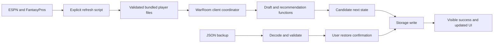

# Architecture and invariants

## Boundaries

The Next.js app shell renders one client-controlled draft room. The application currently has no API routes, application login, database, analytics integration or background player requests. Vercel hosts the shell and bundled assets. Browser storage holds the user's draft.

The diagram shows successful changes. A failed storage write keeps the last successful in-memory state and presents an error. Data-file refresh is a maintainer operation; a browser never contacts those providers during a draft.

## Canonical state

`DraftState` embeds the league configuration, player pool, 108 nullable pick IDs, cursor, started flag, bounded pick history, timestamp and revision. `league.order` is a permutation of stable team indexes 0–5; `myTeam` is a team index, not a draft seat. Pick-array indexes and cursor are zero-based. User-facing overall pick, round and seat are one-based. A cursor of 108 means all picks are complete.

Rosters are derived from pick IDs plus snake order. Do not add independently mutable roster lists, drafted flags or duplicate team ownership to players. Correcting a pick automatically releases its old player because availability is also derived from the pick array.

`Snapshot` contains only picks and cursor. Undo restores a prior pick action; it does not undo league settings or player-data updates. History is capped at 250 snapshots. The identity-safe data update remaps both live picks and all history so undo remains usable after an update.

## State transitions and storage

`WarRoom` coordinates browser effects; domain functions calculate candidate state. Its `commit` function compares the current raw primary save with the raw save this tab last observed, assigns a new revision/time, writes storage, then updates the live ref, React state and success notice. Event handlers use the live ref where rapid input needs the latest committed state.

`saveState` retains the previous valid primary under a backup key, then writes the candidate. It assumes callers have validated their input; it is not a generic validation layer. `decodeState` is the trust boundary for imported/restored storage, validating the league, normalized players, all pick references, duplicates, cursor and every history snapshot. Storage is synchronous and quota failures surface to the user.

The primary and backup are two separate browser writes, not a database transaction. If the primary write fails, the prior primary remains; a backup write may already have occurred. Quota and corruption tests cover recovery behavior. `loadState` attempts the primary, then backup; it never silently replaces irrecoverably damaged data. Restoring or resetting requires explicit confirmation in the UI.

A storage event warns sibling tabs. The raw-save comparison catches stale writes even before a tab processes that event. This is best-effort same-browser protection, not distributed locking or cross-device conflict resolution. Record on one device and one tab at a time.

## Recommendations

The [README formulas](../README.md#how-the-recommendation-works) are the model contract. `valuePlayers` computes stable baselines from the whole original pool. `recommend` filters drafted players, applies roster fit, then combines player value, next-turn opportunity cost, tier urgency, need and optional source risk/upside.

The forecast targets the next turn after the current pick when the user is on the clock; otherwise it targets the user's upcoming pick. Repeated opponents update expected positional counts after each intervening pick. Survival numbers are directional heuristics. The named likely alternative and expected best alternative value are distinct calculations.

Keep coefficients in `config.ts`. Changing source data affects recommendations even without changing coefficients; record its retrieval date separately from app releases. A player with aggregate points and no stat breakdown cannot be rescored correctly. `dstPoints` and `otherPoints` are already points and retain multiplier 1.

## UI and accessibility

`WarRoom` owns persisted state, overlays and navigation. `Setup` edits a local preview until save, except the explicit matched current-data update for an existing draft/history. `DraftBoard` and `EditPick` receive state and callbacks. `Modal` handles focus entry/return, Tab containment, Escape and scroll locking. Draft shortcuts yield to text inputs and dialogs.

The version chip has a separate local open/closed state. Its log is read-only metadata and cannot change a draft. Small-screen layouts preserve clock, search and primary navigation. Print output uses roster text rather than the interactive board.

## Extending safely

Application version `1.1.0` is independent of `DraftState.version = 1`. Do not bump the save schema merely to display a new chip. A future schema change needs an explicit migration, fixtures from earlier versions, failure recovery and rollback compatibility notes. See the [roadmap](ROADMAP.md) for the separate season-state boundary.
